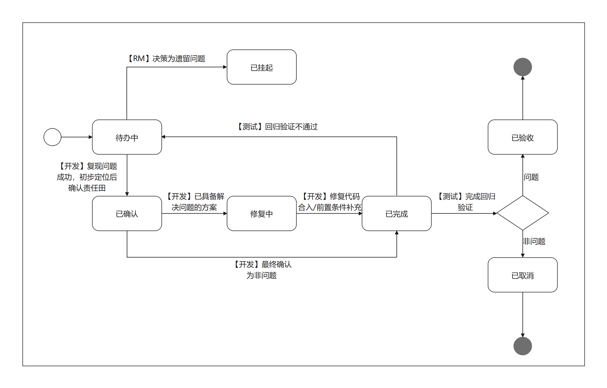

# 社区版本issue创建处理流程与规范
openEuler是一个开源、免费的Linux发行版平台，通过开放的社区形式与全球的开发者共同构建一个开放、多元并且架构包容的软件生态体系。openEuler发布每年均会发布多个版本，在版本测试过程中，会通过缺陷类的issue跟踪测试发布问题的修复，为了更好的协同测试参与人员、开发参与人员以及release团队的协同，现将社区issue的规范流程文档化以支持版本的规范运作。

# 社区版本ISSUE提单规范
## ISSUE属性
|属性|是否必须|规范内容|
|:-:|:-:|:-|
|类型|是|问题类issue选择`缺陷`;需求类issue选择`需求`|
|负责人|是|根据[community](https://gitee.com/openeuler/community)仓库中各[sig](https://gitee.com/openeuler/community/tree/master/sig)目录sig-info.yaml中的committer/maintainer填写对应责任人|
|里程碑|是|选择对应版本的里程碑，里程碑命名如下`openEuler-<os_version>-round-<test_round>` or `openEuler-<os_version>-<extension>-round-<test_round>`|
|优先级|否|基于问题严重级别进行选择：严重/主要/次要/不重要|
|标签|否|sig信息/是否DT缺陷流出等(FST)|

版本测试里程碑命名规范：
- 根据openEuler版本和测试轮次组合里程碑名
- 扩展信息`extension`可附在os版本信息和测试轮次终件
> 注：以openEuler 22.09版本，第4次转测轮次为例，里程碑为`openEuler-22.09-round-4`;以openEuler 22.03 LTS的xx架构版本，第2次转测轮次为例，里程碑为`openEuler-22.03-LTS-xx-round-2`

## 缺陷类ISSUE处理流程



- 问题遗留需在release-sig例会上公开评审并给出结论。(挂起状态应由release成员进行修改)
- `已完成`状态为问题修复责任开发者在修复问题或者给出一定闭环结论后修改的状态，并不等于`已验收`，后续需要问题提出者进行回归闭环
- 已经过测试验收的已验收状态是为问题解决。（已验收状态应由测试人员(问题创建人)/QA committer/maintainer进行修改）
- 版本`已挂起`的问题需要在后续版本持续跟踪

## 缺陷类ISSUE开发者结论性评论书写模板
当缺陷类ISSUE状态处于待办中，开发者分析定位对ISSUE定性后，应该按照下述模板进行评论，视为有效
### 1. 问题单有效场景（即分析后认为该缺陷类ISSUE为问题）
```
【问题定性】问题
【问题根因】xxxxxx（根因描述）
【解决方案】xxxxxx（阐述计划修复此问题的大致思路）
```
### 2. 问题单无效场景（即分析后认为该缺陷类ISSUE为非问题）
```
【问题定性】非问题
【定性理由】xxxxxx（至少需要给出对应于当前问题单场景的结论，存在明确逻辑链以及辅助理解的截图或者跳转链接）
```
## issue定级参考

| 参考维度 | 严重 | 主要 | 次要 | 不重要 | 参考 |
| :-:| :- | :- | :- | :- | :- |
| 功能 | 1. 存在阻塞OS基础测试的问题，并且导致其他服务器、操作系统等不能提供正常服务（包括客户端）。  | 1、需求中明确要去的需求没有实现或者实现不正确，造成特性无法满足需求<br>2、存在阻塞组件基础测试的问题，但不影响OS及其他程序正常运行。 | 1、规格实现有问题，但未造成整个特性失效；<br>2、存在阻塞组件模块功能测试的问题，但不影响该组件基础功能及其他程序正常运行。 | 1、拼写等UCD错误；2、易用性问题；<br>3、功能需要增加、优化的建议 | NA |
| 性能 | 1. 性能测试结果低于规格[30%,) | 1. 性能测试结果低于规格[20%, 30%)<br>2. 长时间测试性能下降趋势明显（下降幅度[5%,） | 1. 性能测试结果低于规格[10%, 20%)<br>2. 长时间测试性能下降（下降幅度[0%,5%） | 1. 性能测试结果低于规格[0%, 10%) | NA |
| 安全 | 1. 存在 CVSS [9，） 分的CVE漏洞未修复 | 1. 存在 CVSS [7，9） 分的CVE漏洞未修复<br>2. 存在 病毒、木马 等恶意文件<br>3. 存在安全测试基线用例未通过<br>4. 存在开源片段引用问题<br>5. 存在License使用不合规问题 | 1. 存在 CVSS [4，7） 分的CVE漏洞未修复<br>2. 存在未使用的安全编译选项<br>3. 存在安全编码问题 | 1. 存在 CVSS [0，4） 分的CVE漏洞未修复 | [SecureRelease.md](https://gitee.com/openeuler/security-committee/blob/master/guide/SecureRelease.md) |

## 软件包安装校验问题ISSUE创建引导
安装校验类问题一般以此类detail为主：nothing provides xx needed by yy

1.若因为xx持续编译失败导致，查看对应仓库是否已有issue，如果有，在原issue描述中补充"导致yy安装缺依赖”；如果没有，参考引导3决定是否提issue；

2.若因为xx版本不满足导致：
（1）若因为xx或者yy最近升级/降级导致，遵循谁引入问题给谁提单原则提issue；
（2）若因为xx/yy持续编译失败导致，参考引导1；

3.以下情形的单包编译问题优先反馈给CICD sig分析（场景可持续补充）：
（1）下载依赖失败；
（2）提示缺少依赖，但是依赖已确认在repo中；
（3）job消费异常：超时退出/长时间在submit状态；